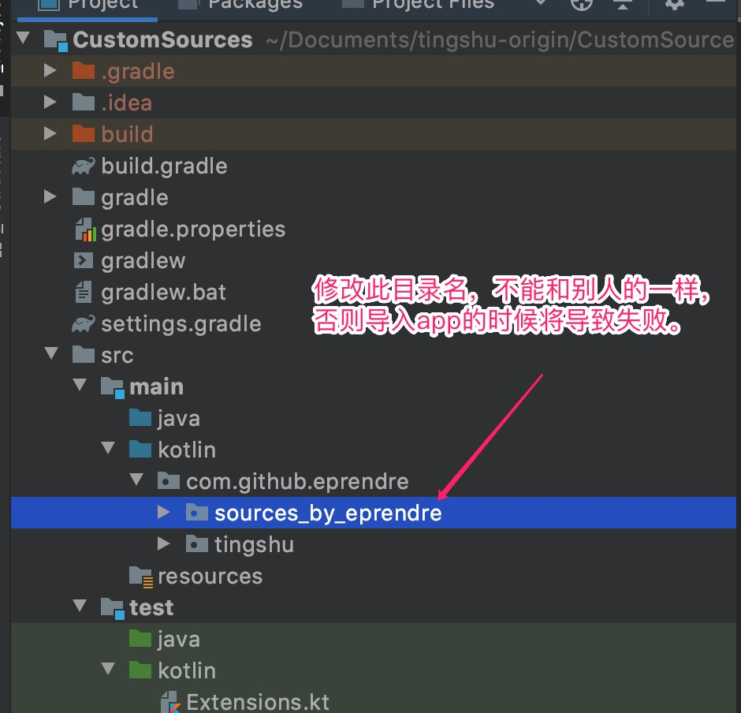
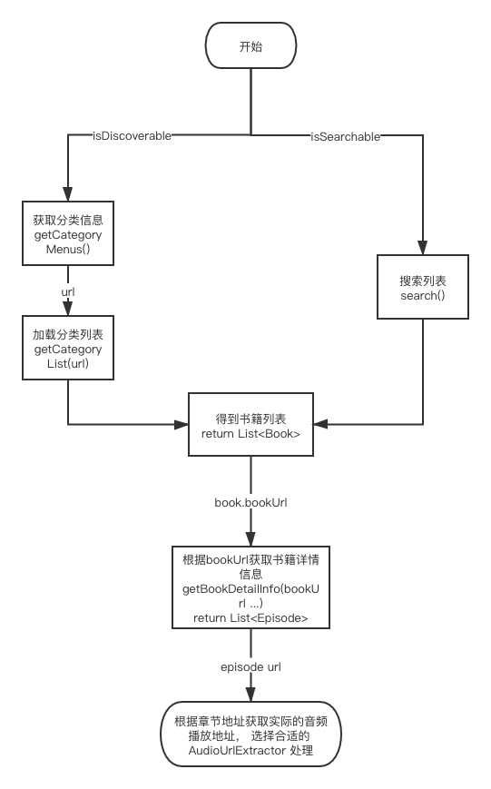
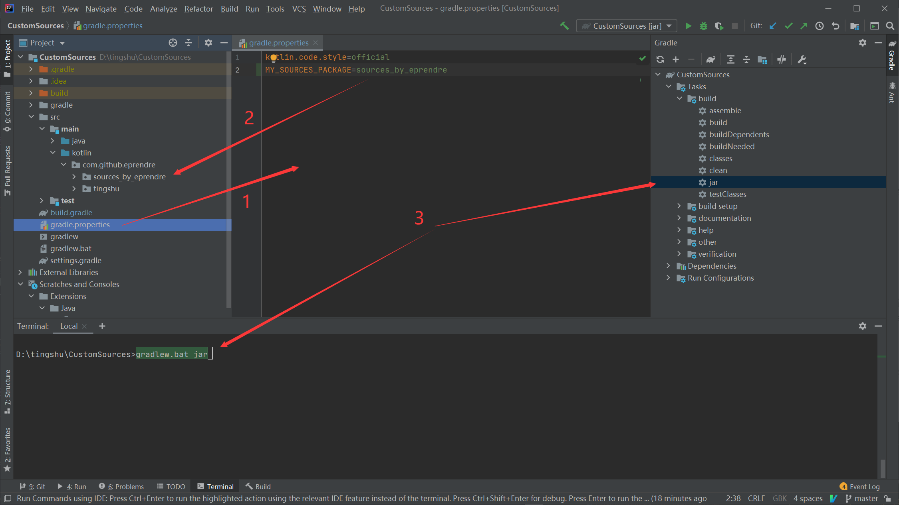
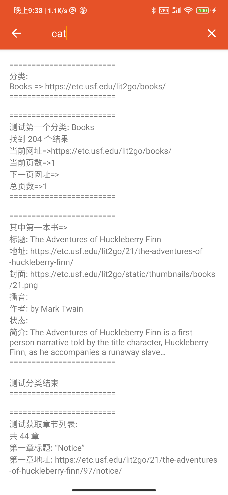

# 我的听书

一款自用的安卓听书app

## 网友制作的订阅源

添加方法：复制下方网址，打开app左侧菜单源管理，右上角点击添加。

* 听书源（若已有内置源无需重复添加） `https://eprendre2.coding.net/p/tingshu/d/tingshu/git/raw/master/TingShuSources/external_sources.json`
* ASMR 相关，作者/老陈: `https://kylo94.coding.net/p/tingshuyuan/d/UpdateJar/git/raw/master/kyloasmr.json`
* 作者/鸽子: `https://tingshu1.coding.net/p/tingshu_ting22/d/tingshu_ting22/git/raw/master/source.json`

## 视频教程

* 自定义源：[https://www.bilibili.com/video/BV1jk4y1B75a](https://www.bilibili.com/video/BV1jk4y1B75a)
* 订阅制作：[https://www.bilibili.com/video/BV1MV411z7kJ](https://www.bilibili.com/video/BV1MV411z7kJ)

老陈做的教程(更适合新手)： [https://www.bilibili.com/video/BV1Jf4y1C7m8](https://www.bilibili.com/video/BV1Jf4y1C7m8)


## 下载

* [Release](https://github.com/eprendre/tingshu/releases)
* [蓝奏云](https://pan.lanzoux.com/b873905)

## 自定义源

请参考 `CustomSources` 项目，这是一个纯 java/kotlin 项目，用 IDEA 打开即可，不需要 Android Studio 以及安卓环境。零基础的同学请搭建好 java 开发环境，比如安装 jdk 并且添加环境变量。
app 里面已经集成了网络请求库`Fuel` 以及HTML解析器 `Jsoup`， 此自定义源项目最好直接使用这两个库，不要引入额外的第三方库。

### 第一步：重构目录名

需要保证目录名独一无二, 比如我们取名为 `sources_by_xxx`，后续皆用此名举例。


### 第二步：开始编写自定义源

在第一步的目录下面新建一个类继承`TingShu`，参考注释和代码示例编写相应的代码。附一份粗浅的代码执行逻辑图。



### 第三步：自定义源入口

把第二步编写好的一个或多个源添加至 `SourceEntry` 的 `getSources` 里， app 端会通过这个方法获取源。

### 第四步：打包 jar 文件

1. 在`gradle.properties`里面修改`MY_SOURCES_PACKAGE=sources_by_xxx`
1. 解压dx_win.zip，原地解压即可，不要改路径。(使用 mac 或者 linux 的同学无需解压，请自行安装安卓SDK并添加dx到环境变量)
1. 打开命令行，在项目根目录输入: `./gradlew jar` 或 windows 平台：`gradlew.bat jar`。不喜欢命令行的同学可以直接在IDEA右方找到Gradle->CustomSources->build->jar 双击。
1. 此时在项目目录/build/libs/ 里面出现 CustomSources-1.0-SNAPSHOT.jar。如果dx_win被正确解压，则自动生成 `sources_by_xxx.jar`, windows 系统还会生成一个 upload.bat 文件。



### 第五步：添加 sources_by_xxx.jar 包至 app

有两种添加方式

1. 自动添加：运行 upload.bat 即可。（需要先配置好adb的环境变量，如果没有adb的同学可以去解压项目里的adb.zip，放到合适的地方并添加环境变量)

1. 手动添加：把 jar 包移至手机 app 目录下: `/sdcard/Android/data/com.github.eprendre.tingshu/files/jars/`， app 会在启动时自动加载。

1. 订阅添加。写一个接口，然后在 app 的自定义源管理右上角添加。 接口参考：[https://eprendre2.coding.net/p/tingshu/d/tingshu/git/raw/master/TingShuSources/external_sources.json](https://eprendre2.coding.net/p/tingshu/d/tingshu/git/raw/master/TingShuSources/external_sources.json)。订阅方式的好处是源作者可以更轻松的维护源，只要在接口里修改版本号，app 每次启动时会自动检测更新。

举例：

```json
{
    "version": 27,
    "entry_package": "sources_by_eprendre",
    "download_url": "https://eprendre2.coding.net/p/tingshu/d/tingshu/git/raw/master/TingShuSources/sources_by_eprendre.jar",
    "update_msg": "外置源兼容最新版",
    "support_url": ""
}
```

接口字段说明：

* `version`: 为数字类型，代表版本号。 app 以此来判断这个 jar 包是否有更新。
* `entry_package`: 为第一步提到的目录名，app下载 jar 包后也会自动命名为此名字。这是 app 找到相关类的关键。
* `download_url`: jar 包下载地址。
* `update_msg`: 更新信息。
* `support_url`: 此参数不为空时，在app长按订阅源将出现`支持`选项。源作者可以放自己的赞赏二维码图片链接，或者任意自己想放的链接。

接口或者 jar 包都可以在 coding 或者 github 免费托管，国内用户推荐 coding 。

### 调试

app 将在最新版加入调试功能。
在源管理 -> 订阅 -> 选择一个源，长按 -> 调试，进入。

上方搜索框输入`cat`将自动调试分类相关逻辑， 输入其它关键词则调试搜索相关逻辑。


